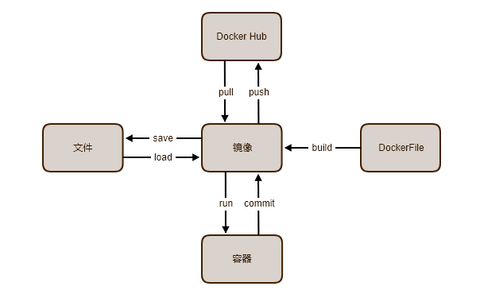

## [docker-doc](https://jueee.github.io/docker-doc/)

### 安装Docker

- [install-docker](install-docker.md)：安装 Docker
- [install-docker-compose](install-docker-compose.md)：安装 docker-compose
- [install-docker-harbor](install-docker-harbor.md)：安装 Docker 仓库 Harbor

### 应用打包

- [package-java-app](package-java-app.md)：打包 `JavaApp` 应用示例
- [package-java-web](package-java-web.md)：打包 `JavaWeb` 应用示例

### 组件打包

-	[build-debian](build/build-debian.md) ：debian
-	[build-elasticsearch](build/build-elasticsearch.md)： elasticsearch 和 kibana
-	[build-fastdfs](build/build-fastdfs.md) ：fastdfs
-	[build-jdk8](build/build-jdk8.md)：jdk8
-	[build-kafka](build/build-kafka.md)：kafka
-	[build-logstash](build/build/build-logstash.md)：logstash
-	[build-mysql](build/build/build-mysql.md)：mysql
-	[build-neo4j](build/build-neo4j.md)：neo4j
-	[build-openoffice](build/build-openoffice.md)：openoffice
-	[build-redis](build/build-redis.md)：redis
-	[build-rinetd](build/build-rinetd.md)：rinetd，端口映射/转发/重定向。
-	[build-zookeeper](build/build-zookeeper.md)：zookeeper     

### 相关服务

- [move-docker-data](move-docker-data.md)： 迁移 docker 默认仓库数据

## docker 组件关系

Docker 各个组件的关系图：

