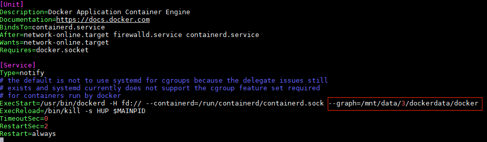

## 迁移服务器 Docker 镜像

docker 本地镜像默认存储地址：

```
/var/lib/docker
```

若镜像较多，则 `/var/lib/docker/overlay2` 占用会较大，此时，需要进行目录迁移工作。

首先需要停止docker服务

```
systemctl stop docker
```

通过命令df -h 先去看下磁盘大概的情况，找一个大的空间

```
/mnt/data/3/dockerdata
```

开始迁移

```
rsync -avzP /var/lib/docker /mnt/data/3/dockerdata
```

参数解释：

- -a，归档模式，表示递归传输并保持文件属性。
- -v，显示rsync过程中详细信息。可以使用"-vvvv"获取更详细信息。
- -P，显示文件传输的进度信息。(实际上"-P"="--partial --progress"，其中的"--progress"才是显示进度信息的)。
- -z,   传输时进行压缩提高效率。

指定新的docker目录

```
vim /lib/systemd/system/docker.service
```

在 ExecStart 加入:  

```
 --graph=/data/docker/lib/docker
```



重启docker

```
systemctl daemon-reload
systemctl restart docker
systemctl enable docker
```

启动之后确认docker 没有问题，删除旧的 `/var/lib/docker/` 目录。

