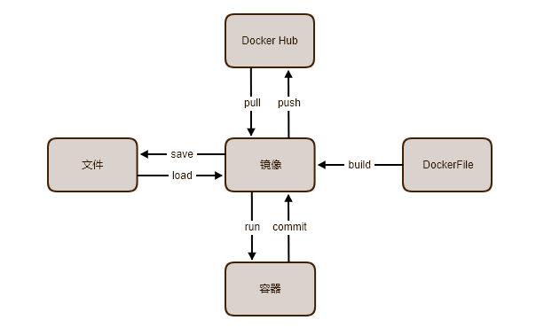

## 基本功能

### 容器基本功能

列出所有容器：

> docker ps -a

进入容器：

> docker exec -it 7a76243b1518 bash

进入容器时，应保证容器正在运行：

> docker start trusting_noyce

向容器中复制内容：

> docker cp FileName upbeat_cerf:filePash
>

运行一个容器：

> docker run -h phishing -i -t debian /bin/bash

将容器提交为镜像

> docker commit -m "add phishing" -a "phishing" elastic_edison phishing:v1
>
> docker commit 39eaa5aa7332 python3.6.4-dev

### 镜像基本操作

列出所有镜像：

> docker images

进入镜像：

> $ docker run -it 7b86326ee5de /bin/bash

删除镜像：

> docker rmi 7b86326ee5de

将镜像保存为文件：

> docker save -o phishing.tar 88a175a4e5bf

从文件通过命令载入镜像：

> docker load < phishing.tar

使用新的镜像来启动容器：

> docker run -t -i 88a175a4e5bf /bin/bash

查看镜像信息：

> docker inspect 7b86326ee5de

## docker 组件关系

Docker 各个组件的关系图：

