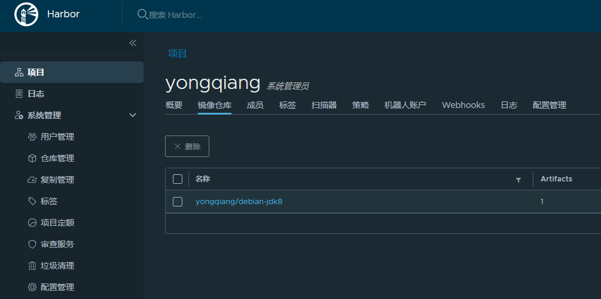

## 安装 docker harbor

GitHub

> https://github.com/goharbor/harbor

下载地址

> https://github.com/goharbor/harbor/releases

#### 安装

```shell
$ wget https://github.com/goharbor/harbor/releases/download/v2.0.0-rc2/harbor-offline-installer-v2.0.0
$ tar -zxf harbor-offline-installer-v2.0.0-rc2.tgz
$ cd harbor/
$ cp harbor.yml.tmpl harbor.yml
$ sudo ./install.sh
```

授权用户

```shell
$ chown -R dir common
$ chown dir docker-compose.yml
```

harbor.yml 修改内容：

```yml
# The IP address or hostname to access admin UI and registry service.
# DO NOT use localhost or 127.0.0.1, because Harbor needs to be accessed by external clients.
hostname: debian.wei.org

# https related config
https:
  # https port for harbor, default is 443
  port: 443
  # The path of cert and key files for nginx
  certificate: /your/certificate/path
  private_key: /your/private/key/path
  
# The default data volume
data_volume: /data

# The initial password of Harbor admin
harbor_admin_password: Harbor12345
```

#### 服务操作

关闭服务

```shell
$ sudo docker-compose down
```

开启服务

```shell
$ sudo docker-compose up -d
```

#### 上传 harbor

登录harbor

```shell
$ docker login debian.wei.org
Username: admin
Password:
Login Succeeded
```

打 tag

```shell
$ docker tag debian-jdk8:v1 debian.wei.org/yongqiang/debian-jdk8:v1.0.0
```

push 

```shell
$ docker push debian.wei.org/yongqiang/debian-jdk8:v1.0.0
```

#### 访问 harbor

> http://192.168.31.130/

登录：admin/Harbor12345

上传的镜像：



#### 问题解决

##### 问题一：

```shell
$ docker login debian.wei.org
Username: admin
Password:
Error response from daemon: Get https://debian.wei.org/v2/: dial tcp 10.196.8.152:443: connect: connection refused
```

配置 `/etc/docker/daemon.json ` 文件，增加 `insecure-registries` 配置

```json
{
     "insecure-registries":["debian.wei.org"]
}
```

并重启 docker 生效

```shell
$ systemctl restart docker.service
$ sudo service docker restart
```

##### 问题二

> ERROR: for harbor-portal  Cannot start service portal: failed to initialize logging driver: dial tcp 127.0.0.1:1514: connect: connection refused

排查：

```
$ docker logs harbor-log
sudo: error in /etc/sudo.conf, line 0 while loading plugin "sudoers_policy"
sudo: /usr/lib/sudo/sudoers.so must be owned by uid 0
sudo: fatal error, unable to load plugins
```

解决：

```
# chmod 644 /usr/libexec/sudo/sudoers.so
# chown -R root /usr/lib/sudo
$ docker rmi goharbor/harbor-log:v2.0.0
```

