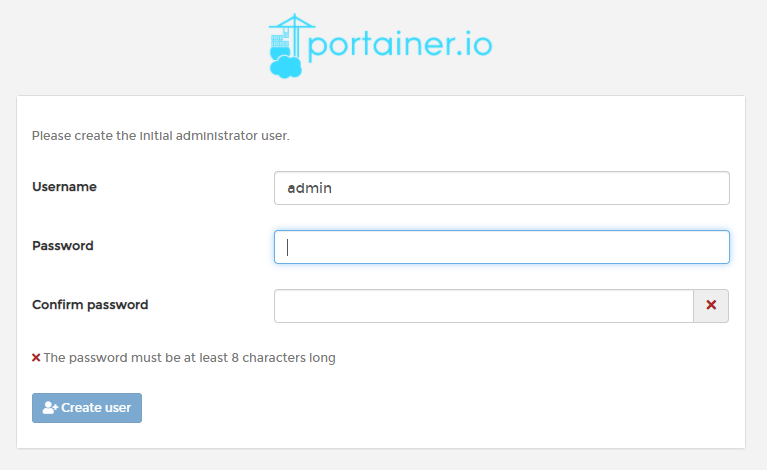
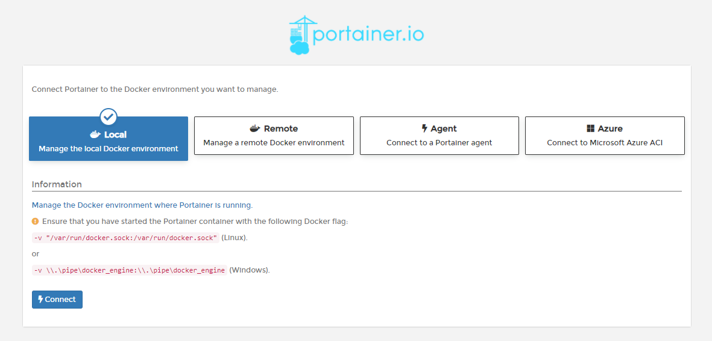
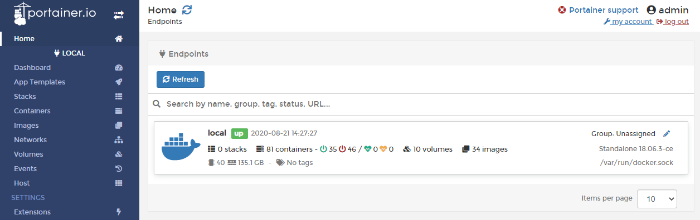
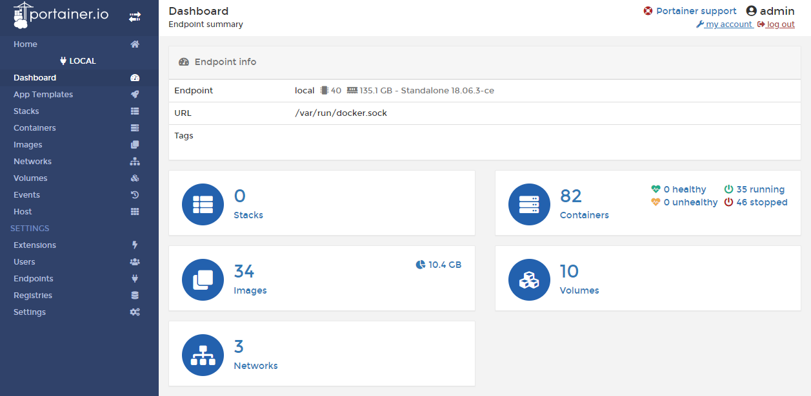

## Docker管理工具portainer

### 介绍

**Portainer** 是Docker的轻量级，跨平台和开源管理UI。

Portainer提供了Docker的详细概述，并允许您通过基于Web的简单仪表板管理容器，图像，网络和卷。它最初是Docker UI的分支。 但是，开发人员现在已经重写了几乎所有的Docker UI原始代码。 他还彻底修改了UX，并在最新版本中添加了更多功能。 

截至目前，它已经引起了用户的极大关注，并且现在已经有超过一百万的下载量！ 它将支持GNU / Linux，Microsoft Windows和Mac OS X。


### 安装

下载镜像

```shell
$ docker pull portainer/portainer
```

测试安装

```shell
$ docker run -d -p 19000:9000 --restart=always -v /var/run/docker.sock:/var/run/docker.sock --name prtainer-ui portainer/portainer
```

### 访问

首次登陆需要注册用户，给管理员用户admin设置密码。



单机版这里选择local即可，选择完毕，点击Connect即可连接到本地docker。

注意：该页面上有提示需要挂载本地 /var/run/docker.socker与容器内的/var/run/docker.socker连接。因此，在启动时必须指定该挂载文件。



主界面：



选择 local：

