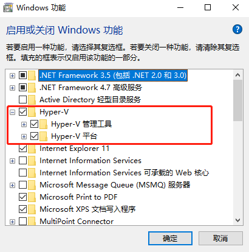
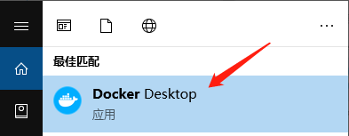
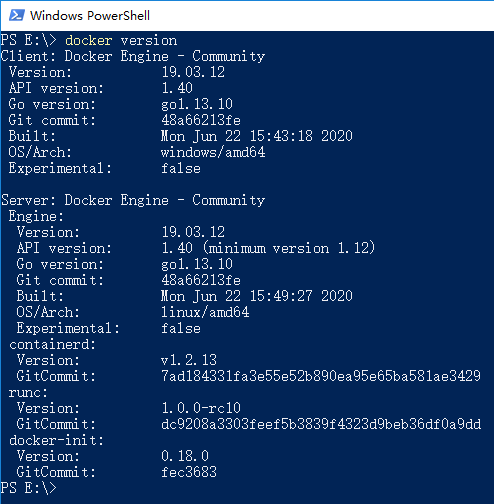
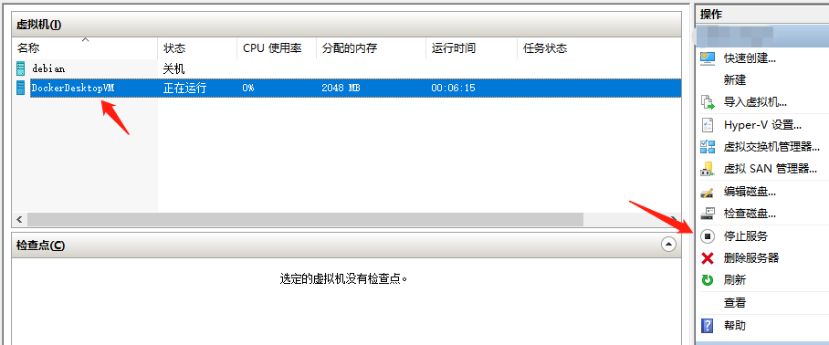
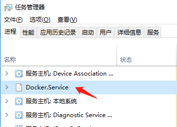
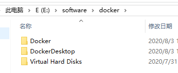
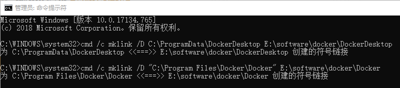

## Windows 10 安装docker

### 相关文档

- [**安装文档**](https://docs.docker.com/docker-for-windows/install/#download-docker-for-windows)
- [博客](https://www.cnblogs.com/lgg20/p/13186776.html)

### 环境准备

- Windows 10 64位：专业版，企业版或教育版（内部版本16299或更高版本）。
- 必须启用Hyper-V和Containers Windows功能。

#### 启用Hyper-V

进入电脑的控制面板->程序->启用或关闭Windows功能->把Hyper-v勾上，启用后电脑会重启。




### 安装Docker

进入网址 [下载地址](https://hub.docker.com/editions/community/docker-ce-desktop-windows/) 下载稳定版并安装。安装完成后会要求重启电脑。

- 出现提示时，请确保在“配置”页面上选择了“ **启用Hyper-V Windows功能”**选项。

### 启动Docker

Docker Desktop在安装后不会自动启动。要启动Docker Desktop，请在桌面打开 **Docker Desktop** 快捷方式或者搜索Docker，然后在搜索结果中选择**Docker Desktop**。



当状态栏中的鲸鱼图标保持稳定时，表明Docker Desktop正在运行，并且可以从任何终端窗口访问。


命令行验证：



### 迁移数据

windows10 docker 从C盘迁移到其他盘。

windows上安装的docker其实本质上还是借助与windows平台的hyper-v技术来创建一个Linux虚拟机。执行的所有命令其实都是在这个虚拟机里执行的，所以所有pull到本地的image都会在虚拟机的Virtual hard disks目录的文件中，这个文件就是虚拟硬盘文件。

#### 停止服务



**进入windows任务管理器，停掉docker后台进程**。



#### 剪切数据

将 C:\Program Files\Docker 和 C:\ProgramData\DockerDesktop 剪切到你想放的磁盘下

旧版本的 docker的根镜像存放目录会在C:\Users\Public\Documents\Hyper-V\Virtual Hard Disks



#### 创建符号链接

打开管理员命令行

```
C:\WINDOWS\system32>cmd /c mklink /D C:\ProgramData\DockerDesktop E:\software\docker\DockerDesktop
为 C:\ProgramData\DockerDesktop <<===>> E:\software\docker\DockerDesktop 创建的符号链接

C:\WINDOWS\system32>cmd /c mklink /D "C:\Program Files\Docker\Docker" E:\software\docker\Docker
为 C:\Program Files\Docker\Docker <<===>> E:\software\docker\Docker 创建的符号链接

C:\WINDOWS\system32>cmd /c mklink /D "C:\Users\Public\Documents\Hyper-V\Virtual Hard Disks" "E:\software\docker\Virtual Hard Disks"
为 C:\Users\Public\Documents\Hyper-V\Virtual Hard Disks <<===>> E:\software\docker\Virtual Hard Disks 创建的符号链接
```

如下图所示：



### 问题处理

win10 docker小鲸鱼启动后：

docker ps -a

**报错：**
Error response from daemon: open \.\pipe\docker_engine_linux: The system cannot find the file specified

**在win10 命令行提示符执行：**

```
  Net stop com.docker.service
  Net start com.docker.service
```

### 注意事项

启用 `Hyper-V` 之后，`VMware` 虚拟机会启动异常。